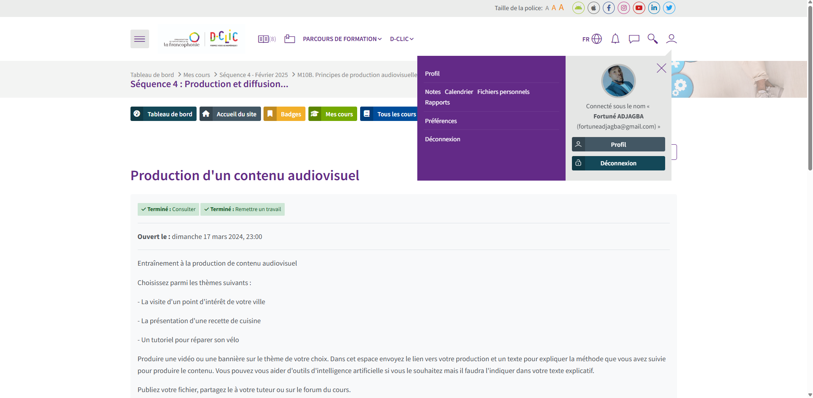

# 🎬 Production Audiovisuelle : Grand Marché de Lomé
Ce dépôt contient le projet de production audiovisuelle réalisé dans le cadre du **Programme D-CLIC OIF** en Marketing Numérique.

Il s'agit d'un **spot vidéo** mettant en valeur le **Grand Marché de Lomé** (Togo), avec une méthodologie complète de conception, de production et de diffusion web .

  

----

### Points Forts du Projet & Compétences

* **Marketing Numérique & Contenu** : Application des principes de production et de diffusion de contenus adaptés au web.
* **Scénarisation & Montage** : Conception d'un scénario détaillé (séquences d'ouverture, exploration, conclusion) et réalisation du montage à l'aide de **Canva Pro**.
* **Techniques Vidéo** : Utilisation de plans variés (aérien, rapprochés), ajustement de la musique de fond et étalonnage des couleurs pour une ambiance chaleureuse.
* **Identité Visuelle** : Application d'une charte graphique définie (couleurs inspirées du drapeau Togolais, typographies lisibles).
* **Diffusion Web (SEO)** : Publication du contenu sur **GitHub Pages** et ajout de balises `<meta>` pour l'optimisation SEO (Grand Marché Lomé, Togo, Afrique, tourisme).

---

### 🔗 Lien vers la Vidéo Déployée

---

#### 🛠️ Outils Utilisés

| Catégorie | Outil / Technologie | Rôle dans le Projet |
| :--- | :--- | :--- |
| **Montage Vidéo** | Canva Pro | Assemblage, transitions, ajout de texte, audio. |
| **Sources Médias** | Pexels, Freepik | Sélection d'images, vidéos et audio libres de droits. |
| **Code / Déploiement** | VSCode, HTML/CSS | Création du blog sur GitHub Pages pour l'hébergement du contenu. |
